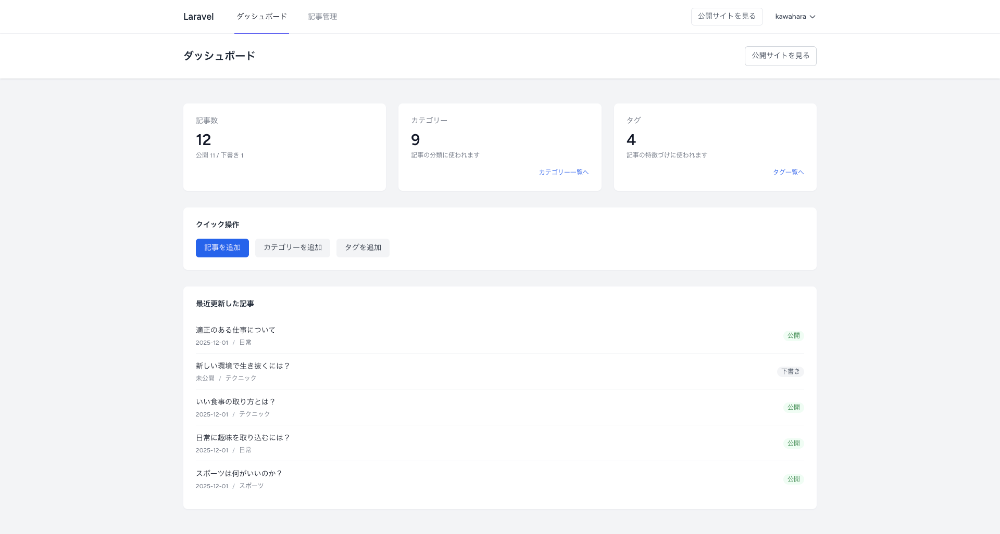
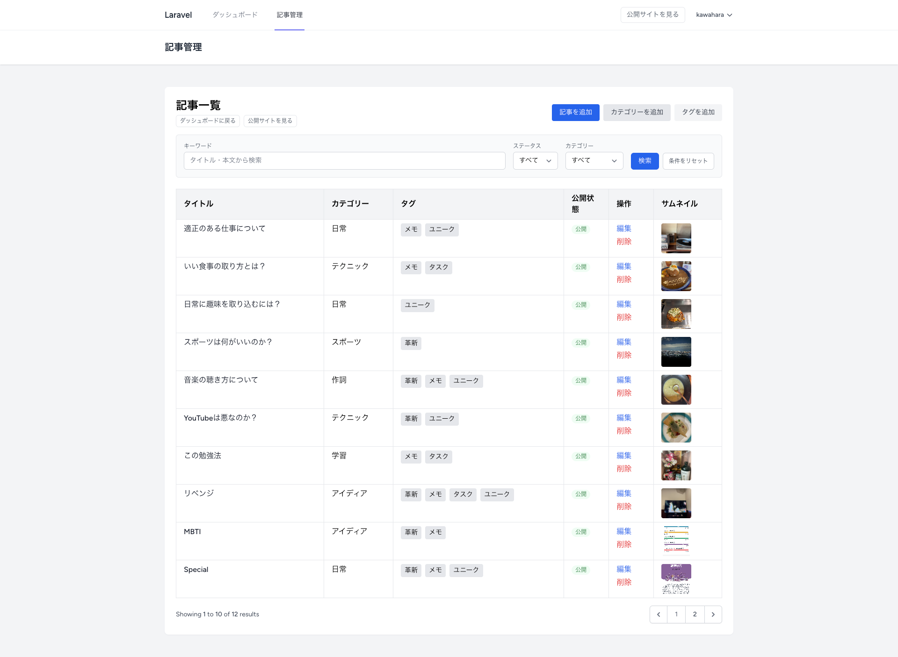
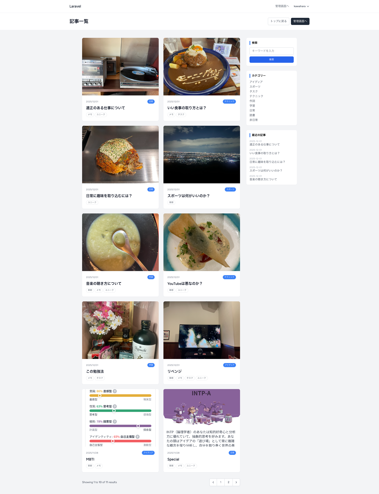

# ブログ風コンテンツ管理ツール（Laravel × Tailwind CSS）

技術ブログや個人サイト向けのシンプルなコンテンツ管理ツールです。  
管理画面から記事・カテゴリー・タグを管理し、公開側ではブログとして閲覧できます。

Markdown 対応のエディタや、ダッシュボード・検索機能などを備え、  
ポートフォリオ・学習用途の両方を意識して構築しました。

---

## 主な機能

### ■ 記事管理

- 記事の新規作成 / 編集 / 削除
- スラッグ管理（未入力時はタイトルから自動生成）
- 公開状態の切り替え（下書き / 公開）
- 公開日時 `published_at` の自動設定
- サムネイル画像のアップロード / 差し替え / 削除
- カテゴリー・タグとの紐付け（多対多）

### ■ カテゴリー / タグ

- カテゴリーの追加 / 編集 / 削除
- タグの追加 / 編集 / 削除
- 記事との多対多リレーション
- 「カテゴリー別」「タグ別」の記事一覧ページ

### ■ 検索・絞り込み（管理画面）

- キーワード検索（タイトル・本文）
- ステータスフィルタ（公開 / 下書き）
- カテゴリーフィルタ
- ページネーションによる一覧表示

### ■ ブログ公開画面

- 記事一覧（カードレイアウト）
  - サムネイル / 公開日 / カテゴリー / タグを表示
  - ページネーション
- 記事詳細
  - パンくずリスト（ホーム > カテゴリー > 記事タイトル）
  - アイキャッチ画像
  - カテゴリー / タグ / 公開日
  - Markdown を整形した本文表示（Tailwind Typography）
  - 前の記事 / 次の記事リンク
  - 関連記事表示
- サイドバー
  - 検索フォーム
  - カテゴリー一覧
  - 最近の記事一覧

### ■ ダッシュボード

- 記事数（公開 / 下書き）、カテゴリー数、タグ数の集計
- 最近更新した記事一覧
- 管理画面から公開サイトへの導線

### ■ 認証

- Breeze によるログイン / 登録 / パスワードリセット
- ログイン必須の管理画面（ダッシュボード / 記事管理 など）

---

## 技術スタック

| 技術                    | 内容                                          |
| ----------------------- | --------------------------------------------- |
| Laravel 10              | バックエンドフレームワーク                   |
| Breeze                  | 認証機能（ログイン / 登録 / パスワード管理） |
| Tailwind CSS            | UI フレームワーク                             |
| @tailwindcss/forms      | フォームスタイルの最適化                      |
| @tailwindcss/typography | 記事本文のタイポグラフィ調整                  |
| EasyMDE                 | Markdown エディタ                             |
| MySQL / SQLite          | データベース                                  |
| PHP 8.1                 | 実行環境                                      |


---

## 設計意図・工夫した点

### 1. 管理画面と公開画面の役割分離

- `<x-app-layout>` をベースに、管理画面と公開側でナビゲーションを出し分け
- 管理画面からは「公開サイトを見る」リンク、公開側からは「管理画面へ」リンクを用意  
  → 実際の運用を想定した導線設計

### 2. Markdown ベースの執筆体験

- 管理画面の本文入力に EasyMDE を採用し、Markdown で記事を記述
- 保存時に Laravel の `Str::markdown()` で HTML に変換し、`body_html` として保持  
  → 執筆時は Markdown、表示時は HTML の良いとこ取り

### 3. ブログ向けタイポグラフィ

- Tailwind Typography プラグインを利用し、記事本文に `.prose` 系クラスを適用
- 見出し・段落・リスト・引用などが自動的にブログ向けのスタイルに整うよう調整  
  → マークアップに集中するだけで、読みやすいレイアウトを実現

### 4. 管理画面のレスポンシブ対応

- 記事一覧テーブルは PC をメインターゲットとしつつ、スマホでも情報が破綻しないよう調整
  - スマホ：タイトルセル内にカテゴリ・タグ・サムネイルを集約して表示
  - タブレット / PC：列ごとの表示で一覧性を重視  
  → 「管理はPC想定だが、スマホでの簡易確認も可能」というバランスを意識

---

## スクリーンショット

### ダッシュボード（PC）



---

### 記事一覧（管理画面 / PC）



---

### 記事作成（Markdown エディタ）


---

### 記事詳細（公開側）



---

## セットアップ

```bash
git clone https://github.com/Tamon-Kawahara/blog-cms.git
cd blog-cms

cp .env.example .env
php artisan key:generate

# .env で DB 設定を行う

# マイグレーション
php artisan migrate

# ストレージのシンボリックリンク（サムネイル表示用）
php artisan storage:link

# フロントエンド
npm install
npm run dev

# 開発サーバー
php artisan serve
